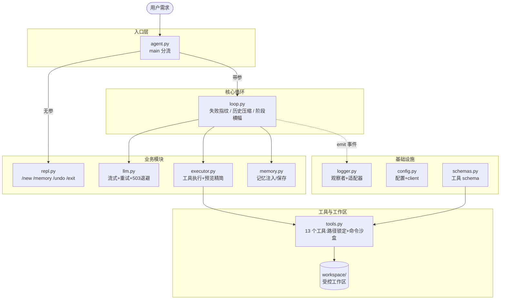

# coding-agent

**Git 仓库**：<https://github.com/linchengll/coding-agent.git>

## 简介

基于 DeepSeek API（OpenAI 兼容接口）的命令行编程智能体。它能理解自然语言需求，自主规划任务、读写代码、执行命令与测试、迭代修复直至完成并 Git 提交，支持一次性任务与交互式 REPL 两种模式。

## 整体架构



按职责拆分的多模块结构：`agent.py` 入口分流；`loop.py` 核心循环与阶段横幅；`llm.py` 流式调用与重试；`executor.py` 工具执行与预览精简；`memory.py` 记忆注入与保存；`repl.py` 交互式 REPL；`config.py` 配置与 client；`schemas.py` 工具 schema；`logger.py` 观察者+适配器日志。`tools.py` 全部工具实现；`system_prompt.txt` 模型行为约束。

## 工具与功能

13 个工具，统一返回 JSON：`{"success", "reason", "result", "context_hint"}`

| 模块       | 工具                                                              |
| -------- | --------------------------------------------------------------- |
| 文件读写     | read\_file / write\_file / edit\_file / list\_dir（版本号跟踪，改前强制先读） |
| 代码检索     | grep（正则搜索）/ list\_symbols（AST 解析类与函数签名）                         |
| Shell 沙盒 | run\_command（白名单 47 项 + 危险命令黑名单 + 30s 超时）                       |
| Git      | git\_status / git\_diff / git\_commit / git\_revert             |
| 任务规划     | update\_plan（拆解子任务、跟踪进度、注入上下文）                                  |
| 结构化测试    | run\_tests（pytest 解析为通过数/失败清单/根因片段）                             |
| 记忆       | 长期任务记忆 + 对话持久化，跨会话自动注入提示词                                       |

## 如何使用

```powershell
pip install -r requirements.txt        # 仅 openai + python-dotenv

在 .env 中配置 DEEPSEEK_API_KEY
#DEEPSEEK_API_KEY=...

python agent.py "在 workspace 实现 FizzBuzz，写测试全部通过后 git 提交"   # 一次性任务
python agent.py                         # 进入交互式 REPL（流式实时输出）
```

REPL 内置命令：`/new` 新任务、`/memory` 查看长期记忆、`/undo` 撤销最近一轮、`/exit` 退出。

## 特色功能

1. **多层安全沙盒**：realpath 路径锁定防目录穿越；命令白名单→后缀归一化→工作区可执行文件三重校验；多命令序列（`&&`）逐段检查，编译产物路径越界即拦截。
2. **失败指纹强制换方案**：同一失败连续 3 次，系统自动注入"强制换思路"消息，阻断模型原地打转的死循环。
3. **结构化测试反馈**：run\_tests 把 pytest 输出解析为失败用例清单 + 根因片段，模型拿到的不是裸文本而是可定位的失败信息。
4. **防幻觉设计**：测试未收集到时明确提示 5 项排查项（而非让模型误判"全部通过"）；工具返回携带 context\_hint 引导下一步。
5. **交互式 REPL 对话**：`python agent.py` 无参即进入多轮对话模式，回答流式实时打字；`/new` 开启新任务（保留长期记忆）、`/memory` 查看任务历史与计划、`/undo` 撤销最近一轮、`/exit` 退出并写入记忆；对话跨会话持久化，从"一次性脚本"升级为"可对话的编程伙伴"。
6. **观察者 + 适配器模式日志**：`logger.py` 用观察者模式解耦日志输出与业务逻辑——`AgentEventEmitter` 作 Subject 暴露统一 `emit(event, data)`，`StageBannerObserver`（阶段横幅）与 `CompactToolObserver`（工具调用单行预览）作 Observer 各自决定如何渲染；agent 流程事件（tool\_call / tool\_result / stage\_change）经适配器转为统一 emit 调用，调用方只管发事件不关心打印方式。日志可扩展：新增输出端只需加一个 Observer，业务代码零改动。

